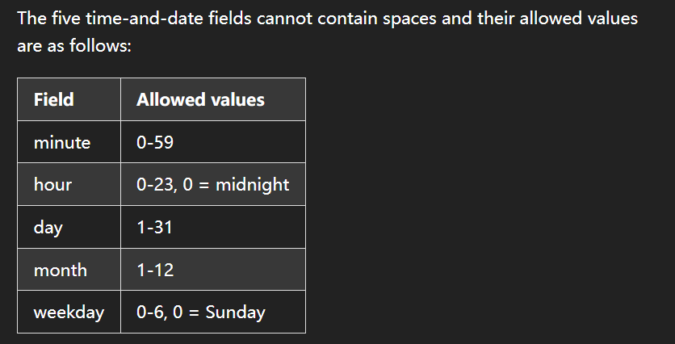

#  Cron Jobs: The Linux Scheduler ⏰

> *"Automate the boring stuff"* – Cron is Linux's built-in task scheduler for running commands at specific times

---

## 🖥️ **Accessing Crontab**
### What is crontab?
The `crontab` (cron table) is a configuration file containing scheduled jobs. Each user has their own crontab.

```bash
# To add a cron job, run the command below:
crontab -e

# The -l option of the crontab command prints the current crontab.
crontab -l
You may get a message no crontab for theia if your crontab is empty.

# Remove your current crontab using
crontab -r
```
