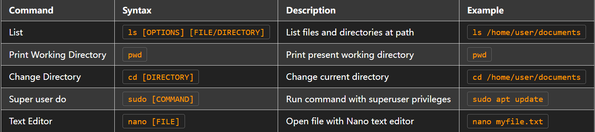
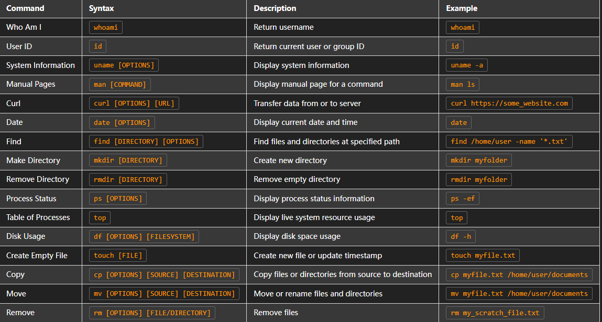
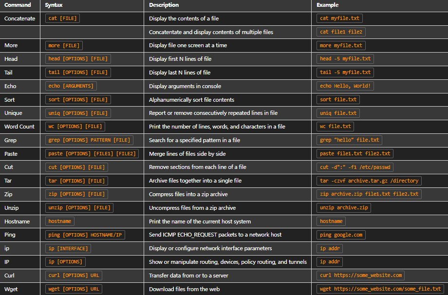
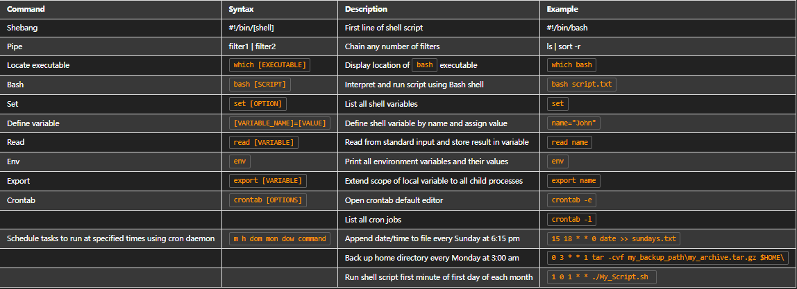

### **introduction to linux**

### **Introduction to Linux Commands**
>**Informational, Navigational, & Management Commands**

>**Working with Text Files, Networking & Archiving Commands**

>**shell Scripting**

**Integrated Linux support**
>Linux also has several commands that you can use for support.

### **man**
The man command displays information on other commands and how they work. It’s short for “manual.” To search for information on a command, enter the command after man. For example, entering man chown returns detailed information about chown, including the various options you can use with it. The output of the man command is also called a “man page.”

### **apropos**
The apropos command searches the man page descriptions for a specified string. Man pages can be lengthy and difficult to search through if you’re looking for a specific keyword. To use apropos, enter the keyword after apropos. 

You can also include the -a option to search for multiple words. For example, entering apropos -a graph editor outputs man pages that contain both the words “graph" and "editor” in their descriptions.

## **whatis**
The whatis command displays a description of a command on a single line. For example, entering whatis nano outputs the description of nano. This command is useful when you don't need a detailed description, just a general idea of the command. This might be as a reminder. Or, it might be after you discover a new command through a colleague or online resource and want to know more. 
